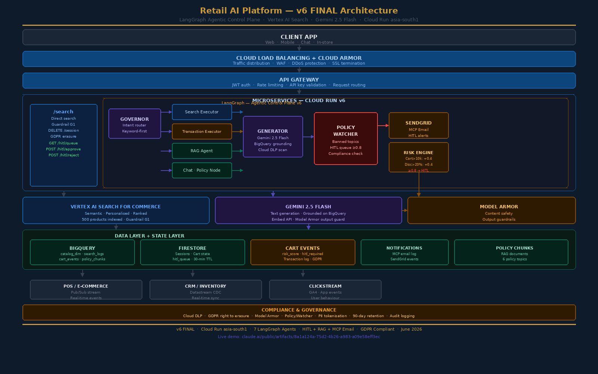

# Retail Agentic AI Platform v6

**7-agent LangGraph Agentic Control Plane on Google Cloud**  
Production deployed · Cloud Run asia-south1 · June 2026

[](https://claude.ai/public/artifacts/8a1a124a-75d2-4b26-a983-a09e58eff3ec)
[](https://retail-ai-api-240442120401.asia-south1.run.app)
[](https://python.org)
[](https://langchain-ai.github.io/langgraph/)

---

## 🎯 Problem Statement

Retail AI implementations fail in production in three predictable ways:

| Problem | Impact |
|---------|--------|
| **Hallucination** | AI recommends out-of-stock or non-existent products — customer trust destroyed |
| **No governance** | AI applies discounts or approves transactions with no audit trail — compliance risk |
| **No human oversight** | High-value transactions auto-approved with no escalation path |

This platform solves all three with a production-grade agentic architecture.

---

## 🏗️ Architecture



### 9-Layer Architecture

```
Client APP (Web · Mobile · Chat · In-store)
        ↓
Cloud Load Balancing + Cloud Armor (WAF · DDoS · SSL)
        ↓
API Gateway (JWT auth · Rate limiting · Routing)
        ↓
Cloud Run Microservices — LangGraph Control Plane
        ↓
Vertex AI Search + Gemini 2.5 Flash + Model Armor
        ↓
BigQuery + Firestore + cart_events + policy_chunks
        ↓
POS/Pub/Sub · CRM/Datastream · Clickstream/GA4
        ↓
MCP Email — SendGrid (HITL alerts · GDPR consent)
        ↓
Compliance — Cloud DLP · GDPR · PII tokenisation · Audit logging
```

---

## 🤖 LangGraph Multi-Agent Flow

```
Governor Agent (keyword-first routing)
        │
        ├── search intent      → Search Executor → Generator → Policy/Watcher
        ├── transact intent    → Transaction Executor → Policy/Watcher
        ├── policy_question    → RAG Agent → Policy/Watcher
        └── casual_chat        → Chat Node → Policy/Watcher
                                                    │
                                               Response to customer
```

### Agent Responsibilities

| Agent | File | Responsibility |
|-------|------|----------------|
| Governor | `governor.py` | Keyword-first intent routing, Gemini fallback |
| Search Executor | `search_executor.py` | Vertex AI Search + Guardrail G1 (zero-stock filter) |
| Transaction Executor | `transaction_executor.py` | Cart ops + 4-factor risk scoring |
| RAG Agent | `rag_agent.py` | BigQuery policy retrieval + Gemini grounding |
| Chat Node | `chat_node.py` | Casual chat + Gemini direct response |
| Policy/Watcher | `policy_watcher.py` | Compliance gate + HITL queue at risk ≥ 0.8 |
| Generator | `generator.py` | Gemini 2.5 Flash + BigQuery grounding + Cloud DLP |

---

## ⚡ Risk Scoring & HITL Workflow

```
Customer checkout
        → Transaction Executor calculates risk score
        → Score >= 0.8 (cart value + discount + bulk + promo pattern)
        → Policy/Watcher queues to Firestore hitl_queue
        → MCP Notifier sends SendGrid alert email
        → Reviewer receives: Approve / Reject buttons
        → POST /hitl/approve or /hitl/reject
        → Decision logged to BigQuery with full audit trail
```

**Risk factors:**
- Cart total > Rs.10,000 → +0.4
- Discount > 20% → +0.4
- Bulk quantity > 5 → +0.3
- Checkout with promo on high-value cart → +0.2

---

## 📚 RAG Pipeline

**Policy questions** are answered using a BigQuery-grounded RAG pipeline:

```
Customer: "what is your return policy?"
        ↓
Governor → intent: policy_question
        ↓
RAG Agent queries BigQuery policy_chunks table
        ↓
Top 3 relevant chunks retrieved
        ↓
Gemini 2.5 Flash generates answer using ONLY retrieved text
        ↓
Zero hallucination — no invented policy details
```

BigQuery table: `retail_mvp.policy_chunks` (6 policy topics)

---

## 🔌 API Endpoints

| Method | Endpoint | Purpose |
|--------|----------|---------|
| GET | `/health` | Health check |
| POST | `/search` | Semantic product search |
| POST | `/chat` | LangGraph agentic chat |
| DELETE | `/session/{id}` | GDPR right to erasure |
| GET | `/hitl/queue` | List pending HITL reviews |
| POST | `/hitl/approve/{id}` | Approve flagged transaction |
| POST | `/hitl/reject/{id}` | Reject flagged transaction |

**Live API:** `https://retail-ai-api-240442120401.asia-south1.run.app`

---

## 🛠️ Tech Stack

| Layer | Technology |
|-------|-----------|
| Orchestration | LangGraph v4 |
| LLM | Gemini 2.5 Flash |
| Search | Vertex AI Search for Commerce |
| Data | BigQuery · Firestore |
| Compliance | Cloud DLP · Model Armor |
| Email | SendGrid (MCP pattern) |
| Runtime | Cloud Run · Docker · Python 3.11 |
| IaC | Cloud Build · Artifact Registry |
| Governance | GDPR · PII tokenisation · Audit logging |

---

## 📊 BigQuery Tables

| Table | Purpose |
|-------|---------|
| `catalog_dim` | 500 products |
| `search_logs` | Query analytics, latency, DLP trigger rate |
| `cart_events` | Transaction log, risk score, HITL flag |
| `policy_chunks` | RAG document store (6 policy topics) |
| `notifications` | MCP email log |

---

## 🚀 Version History

| Version | What Changed |
|---------|-------------|
| v1 | Basic /search + /chat |
| v2 | Hallucination fix + GDPR right to erasure |
| v3 | LangGraph Sprint 1 — Governor + Search + Chat |
| v4 | LangGraph Sprint 2 — Cart + Risk scoring |
| v5 | Sprint 3+4 — RAG + Policy/Watcher + HITL |
| v6 | MCP Email via SendGrid — **FINAL** |

---

## 🔧 Local Setup

```bash
git clone https://github.com/nadeem1971/retail-agentic-ai-platform.git
cd retail-agentic-ai-platform
pip install -r requirements.txt
```

Create `.env`:
```
GCP_PROJECT_ID=your-project-id
GEMINI_API_KEY=your-gemini-key
GEMINI_MODEL=gemini-2.5-flash
API_SECRET_KEY=your-secret
VERTEX_SEARCH_ENGINE_ID=your-engine-id
VERTEX_SEARCH_DATASTORE_ID=your-datastore-id
SENDGRID_API_KEY=your-sendgrid-key
NOTIFICATION_EMAIL=your-email
```

Run:
```bash
uvicorn app.main:app --reload --port 8000
```

---

## ☁️ Deploy to Cloud Run

```bash
gcloud builds submit \
  --tag asia-south1-docker.pkg.dev/YOUR_PROJECT/retail-ai-repo/retail-ai-api:v6

gcloud run deploy retail-ai-api \
  --image asia-south1-docker.pkg.dev/YOUR_PROJECT/retail-ai-repo/retail-ai-api:v6 \
  --platform managed \
  --region asia-south1 \
  --memory 512Mi
```

---

## ✅ Key Outcomes

- **Zero hallucination** — all responses grounded on live BigQuery inventory
- **HITL email end-to-end** — risk flag → SendGrid → Gmail → API approve/reject (status 250 confirmed)
- **GDPR compliant** — right to erasure, Cloud DLP, 90-day retention, PII tokenisation
- **v1 → v6 FINAL in 4 sprints** — Cloud Run asia-south1

---

## 🎮 Live Demo

**[Try the interactive demo](https://claude.ai/public/artifacts/8a1a124a-75d2-4b26-a983-a09e58eff3ec)**  
No login required. Search products, add to cart, test HITL trigger, check return policy.

---

## 👤 Author

**Nadeem Ahmad**  
Principal Enterprise AI Architect  
📧 nadeem.ahmad.arch@gmail.com  
🔗 [LinkedIn](https://www.linkedin.com/in/nadeem-ahmad-0ba5b328/)  
📅 Sessions: [topmate.io/nadeem_ahmad17](https://topmate.io/nadeem_ahmad17)
